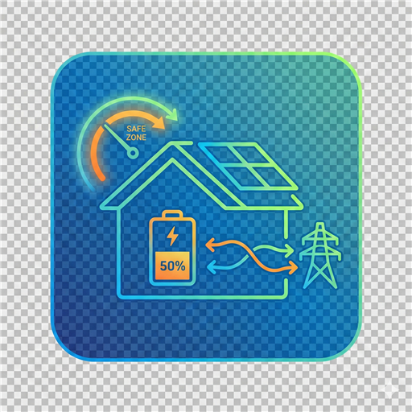

<p align="center">
  
</p>

# Energy Export Monitor for Home Assistant

[](https://github.com/custom-components/hacs)
[](https://github.com/markgraham924/export-monitor/releases)
[](https://github.com/markgraham924/export-monitor/stargazers)

A Home Assistant custom integration that intelligently controls Alpha ESS battery discharge based on Solcast PV forecasts to keep grid exports within safe limits and comply with energy provider terms and conditions.

## Features

- **Smart Export Control**: Automatically calculates safe grid export limits based on PV production and forecasts
- **Alpha ESS Integration**: Works with Alpha ESS systems via the Hillview Lodge custom integration
- **Solcast Forecasting**: Uses Solcast PV forecast data to predict production and optimize discharge
- **Safety Margin**: Configurable safety margin (default 500W = 0.5kWh) to stay within T&C limits
- **Automated Services**: Control discharge via services, automations, or manual buttons
- **Real-time Monitoring**: Sensors showing safe export limits, discharge requirements, and system status

## How It Works

The integration monitors your system every 10 seconds and:

1. **Reads current values**: Battery SOC, PV energy produced today, grid feed today, and Solcast forecast
2. **Calculates export headroom**: `max(pv_energy_today, solcast_total_today) + safety_margin - grid_feed_today`
3. **Calculates discharge duration**: `duration = headroom (kWh) ÷ discharge_power (kW) × 60 minutes`
4. **Controls discharge**: Sets discharge power, duration, and cutoff SOC via Alpha ESS helper entities
5. **Monitors progress**: Tracks discharge to ensure it stays within safe export limits

This keeps your grid export within the safe limit while maximizing self-consumption and preventing breaches of your energy provider's terms and conditions. **Duration scales linearly with available headroom while discharge power remains fixed.**

## Prerequisites

Before installing this integration, you must have:

1. **Home Assistant** 2024.1.0 or later
2. **Alpha ESS System** with [Hillview Lodge Alpha ESS integration](https://projects.hillviewlodge.ie/alphaess/) configured
3. **Solcast PV Forecast** integration installed from HACS
4. **Alpha ESS Helper Entities** configured:
   - `input_boolean.alphaess_helper_force_discharging`
   - `number.alphaess_template_force_discharging_power`
   - `input_number.alphaess_helper_force_discharging_cutoff_soc` (or number entity equivalent)
   - `input_number.alphaess_helper_force_discharging_duration` (optional, for duration control)

### Setting Up Alpha ESS Helper Entities

If you haven't set up the Alpha ESS helper automation, follow the Hillview Lodge guide to create:

```yaml
# configuration.yaml or helpers.yaml
input_boolean:
  alphaess_helper_force_discharging:
    name: Alpha ESS Force Discharging
    icon: mdi:battery-arrow-up

input_number:
  alphaess_template_force_discharging_power:
    name: Alpha ESS Discharge Power Capacity
    min: 0
    max: 10
    step: 0.1
    unit_of_measurement: kW
    icon: mdi:flash
    
  alphaess_helper_force_discharging_cutoff_soc:
    name: Alpha ESS Cutoff SOC
    min: 0
    max: 100
    step: 1
    unit_of_measurement: "%"
    icon: mdi:battery-low
    
  alphaess_helper_force_discharging_duration:
    name: Alpha ESS Discharge Duration
    min: 1
    max: 1440
    step: 1
    unit_of_measurement: min
    icon: mdi:timer
```

## Installation

### HACS (Recommended)

1. Open HACS in Home Assistant
2. Click on "Integrations"
3. Click the three dots in the top right corner
4. Select "Custom repositories"
5. Add the repository URL: `https://github.com/markgraham924/export-monitor`
6. Select category: "Integration"
7. Click "Add"
8. Click "Install" on the Energy Export Monitor card
9. Restart Home Assistant

### Manual Installation

1. Download the latest release from the [releases page](https://github.com/markgraham924/export-monitor/releases)
2. Extract the `custom_components/export_monitor` folder
3. Copy it to your Home Assistant `custom_components` directory
4. Restart Home Assistant

## Configuration

### Via UI (Recommended)

1. Go to **Settings** → **Devices & Services**
2. Click **+ Add Integration**
3. Search for "Energy Export Monitor"
4. Follow the setup wizard:

  **Required Entities:**
  - **Alpha ESS Discharge Button**: Select `input_boolean.alphaess_helper_force_discharging`
  - **Alpha ESS Discharge Power Capacity**: Select `number.alphaess_template_force_discharging_power` (set to your max discharge capacity in kW)
  - **Alpha ESS Cutoff SOC**: Select `input_number.alphaess_helper_force_discharging_cutoff_soc`
  - **Current Battery SOC**: Select your Alpha ESS SOC sensor (e.g., `sensor.alphaess_battery_soc`)
  - **Today's PV Energy (kWh)**: `sensor.alphaess_today_s_energy_from_pv`
  - **Today's Grid Feed (kWh)**: `sensor.alphaess_today_s_energy_feed_to_grid_meter`
  - **Solcast Forecast Total Today (kWh)**: `sensor.solcast_pv_forecast_forecast_today`
  - **Solcast Forecast So Far (kWh, optional)**: `sensor.solcast_forecast_so_far`

  **Optional Settings:**
  - **Target Grid Export**: Target maximum export power in watts (default: 0)
  - **Minimum Battery SOC**: Minimum battery level before discharge stops (default: 20%)
  - **Safety Margin**: Additional margin in kWh to prevent T&C breaches (default: 0.5 kWh)

5. Click **Submit**

### Adjusting Settings

To change configuration options after setup:

1. Go to **Settings** → **Devices & Services**
2. Find "Energy Export Monitor"
3. Click **Configure**
4. Adjust target export, minimum SOC, or safety margin
5. Click **Submit**

## Entities Created

After setup, the integration creates the following entities:

### Buttons
- **Start Discharge**: Manually trigger discharge based on current calculations
- **Stop Discharge**: Stop active discharge immediately
- **Calculate Discharge**: Recalculate discharge requirements

### Numbers
- **Target Export**: Set maximum grid export target (W)
- **Minimum SOC**: Set minimum battery level before discharge stops (%)
- **Safety Margin**: Set safety buffer to prevent T&C breaches (W)

### Sensors
- **Safe Export Limit**: Current calculated safe export limit (W)
- **Discharge Needed**: Amount of discharge power needed (W)
- **Grid Export**: Current grid export power (W)
- **Discharge Status**: Current status (Idle/Needed/Active)

## Services

The integration provides three services for automation:

### `export_monitor.start_discharge`

Start battery discharge. Power and duration are calculated automatically based on configured discharge capacity and available export headroom.

```yaml
service: export_monitor.start_discharge
# No parameters required - all calculated automatically
```

**How it works:**
- Reads discharge power capacity from configured entity (e.g., 3.0 kW)
- Calculates available export headroom (e.g., 1.5 kWh)
- Calculates duration: 1.5 kWh ÷ 3.0 kW × 60 = 30 minutes
- Sets discharge power to 3.0 kW for 30 minutes

### `export_monitor.stop_discharge`

Stop battery discharge immediately.

```yaml
service: export_monitor.stop_discharge
```

### `export_monitor.calculate_discharge`

Recalculate discharge requirements based on current conditions.

```yaml
service: export_monitor.calculate_discharge
```

## Automation Examples

### Auto-Start Discharge When Needed

```yaml
automation:
  - alias: "Auto Start Export Control"
    trigger:
      - platform: state
        entity_id: sensor.export_monitor_discharge_status
        to: "Needed"
        for:
          minutes: 2
    condition:
      - condition: numeric_state
        entity_id: sensor.export_monitor_discharge_needed
        above: 500
    action:
      - service: button.press
        target:
          entity_id: button.export_monitor_start_discharge
```

### Stop Discharge at Night

```yaml
automation:
  - alias: "Stop Export Control at Night"
    trigger:
      - platform: sun
        event: sunset
    action:
      - service: export_monitor.stop_discharge
```

### Adjust Safety Margin During Peak Hours

```yaml
automation:
  - alias: "Increase Safety Margin Peak Hours"
    trigger:
      - platform: time
        at: "16:00:00"
    action:
      - service: number.set_value
        target:
          entity_id: number.export_monitor_safety_margin
        data:
          value: 1000
          
  - alias: "Reset Safety Margin Off-Peak"
    trigger:
      - platform: time
        at: "20:00:00"
    action:
      - service: number.set_value
        target:
          entity_id: number.export_monitor_safety_margin
        data:
          value: 500
```

## Dashboard Card Example

```yaml
type: entities
title: Energy Export Monitor
entities:
  - entity: sensor.export_monitor_discharge_status
  - entity: sensor.export_monitor_safe_export_limit
  - entity: sensor.export_monitor_grid_export
  - entity: sensor.export_monitor_discharge_needed
  - entity: number.export_monitor_minimum_soc
  - entity: number.export_monitor_safety_margin
  - entity: button.export_monitor_start_discharge
  - entity: button.export_monitor_stop_discharge
```

## How the Calculation Works

### Export Headroom Formula (Energy-Based)

```
export_cap_kwh = max(pv_energy_today_kwh, solcast_total_today_kwh) + safety_margin_kwh
export_headroom_kwh = export_cap_kwh - grid_feed_today_kwh
```

### Discharge Duration Calculation

The integration uses a **fixed discharge power** (set by user) and **calculates duration** based on available headroom:

```
duration_hours = export_headroom_kwh ÷ discharge_power_kw
duration_minutes = duration_hours × 60
```

**Example:**
- Export headroom: 1.5 kWh
- Discharge power capacity: 3.0 kW (configured by user)
- Calculated duration: 1.5 ÷ 3.0 × 60 = **30 minutes**

The battery will discharge at 3.0 kW for 30 minutes to consume the 1.5 kWh of available headroom. **Duration scales linearly with headroom while power remains constant.**

The headroom keeps exported energy within 0.5kWh (default safety margin) of the higher of actual or forecast PV for the day.

## Troubleshooting

### Entities Not Found

Ensure all required entities exist and are available:
- Check Alpha ESS integration is properly configured
- Verify Solcast integration is installed and has recent data
- Confirm helper entities are created in Configuration → Helpers

### Discharge Not Starting

Check the following:
- Battery SOC is above minimum level (default 20%)
- Grid export is actually exceeding the safe limit
- Alpha ESS system is not controlled by VPP (Virtual Power Plant)
- Check Home Assistant logs for errors

### Inaccurate Calculations

- Verify grid power sensor reports negative values when exporting
- Check Solcast forecast is updating regularly
- Ensure PV production sensor includes all arrays
- Review safety margin setting (500W = 0.5kWh over 1 hour)

### Enable Debug Logging

Add to `configuration.yaml`:

```yaml
logger:
  default: info
  logs:
    custom_components.export_monitor: debug
```

## Known Limitations

- **Alpha ESS Specific**: Currently only works with Alpha ESS systems using the Hillview Lodge integration
- **Solcast Required**: Requires Solcast PV Forecast integration
- **No VPP Override**: Cannot override Virtual Power Plant control if active
- **10-Second Polling**: Updates every 10 seconds (not real-time)
- **Fixed Power**: Discharge power is fixed; duration varies based on headroom
- **Country Limitations**: Some Alpha ESS features vary by country

## Contributing

Contributions are welcome! Please:

1. Fork the repository
2. Create a feature branch
3. Make your changes
4. Submit a pull request

## Support

- **Issues**: [GitHub Issues](https://github.com/markgraham924/export-monitor/issues)
- **Discussions**: [GitHub Discussions](https://github.com/markgraham924/export-monitor/discussions)

## License

This project is licensed under the MIT License - see the LICENSE file for details.

## Acknowledgments

- [Hillview Lodge Alpha ESS Integration](https://projects.hillviewlodge.ie/alphaess/) for Alpha ESS Modbus integration
- [Solcast PV Forecast](https://github.com/BJReplay/ha-solcast-solar) for solar forecasting
- Home Assistant community for feedback and testing

## Changelog

### 1.0.0 (2026-01-27)
- Initial release
- Alpha ESS battery discharge control
- Solcast forecast integration
- Configurable safety margins
- Real-time monitoring and automation services
